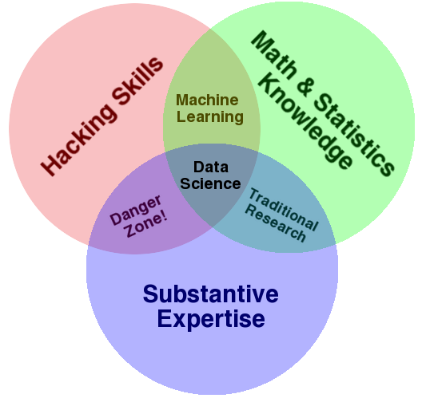

## Tricks for improving quantitative skills
#####  Daniel Falster, EERC, UNSW 
#####  [danielfalster.com](danielfalster.com), [@adaptive_plant](https://twitter.com/adaptive_plant)

---

## Goals

1. Discover skills you want to improve
2. Strategies that help me
3. Keep it real

---

## A little about me

---

---

---

---

### My current roles

- Academic / Biologist
- Data wrangler
- Statistician
- Mathematician/modeller
- Computer scientist
- Data Scientist

 (What are your main roles?) |

---

 [(link)](https://hbr.org/2012/10/data-scientist-the-sexiest-job-of-the-21st-century) 

---

### Most of you are data scientists!

---

## We need to be hackers

---

---

---

---

### Every analysis is new and different

- More data
- New statistics
- Science getting more complex

---

## What quantitative skills do you want to improve?

- Statistics: 
inference, tests 
- Maths: calculus, probability, linear algebra
- Computer science: numerical approximations, software development, High-performance computing
- Coding: data wrangling, visualisation, scripting, reproducible research

 (everyone pick at least one & share) 

---

 [(click to play)](https://www.youtube.com/watch?v=qYZF6oIZtfc) 

---

## Strategies to improve (coding)

---

### When are good times to learn new skills?

 (discuss) 

---

### 1. Each project is a learning opportunity

- focus on what you need
- spend time to learn it
- often takes time but builds capacity
- refer back at later date

---

### 2. Practice reproducible research

- All steps of analysis scripted (R, Python, Matlab)
- Documents your skills/learning
- Invaluable for "future self"
- Pathway to collaboration

---

### 3. Raise awareness of unknowns

- R user groups:  [Environmental computing](http://environmentalcomputing.net/calendar/) 
- Blog posts:  (via twitter, google) 
- Courses: [stats central](http://www.analytical.unsw.edu.au/facilities/stats-central-2), [software carpentry](software-carpentry.org), 
- Online courses: [datacamp](https://www.datacamp.com/)
- Meetups: [Sydney Users of R forum](https://www.meetup.com/R-Users-Sydney) 
- Conferences:  [UseR 2018](https://www.r-project.org/conferences.html) 

---

### Environmental computing

- Fridays 2-3pm, E26 teaching lab 5
- R focussed
- Topics: Project management, data wrangling, plotting, stats, maps, ...
- [http://environmentalcomputing.net/calendar/](http://environmentalcomputing.net/calendar/)

---

### 4. Dive in deep

---

### Two types of deep work

1. In the flow (feels good)
2. Pushing yourself (it hurts a bit)

---

### 5. Learn to problem solve

---

### These strategies make better code

1. [Rubber duck debugging](https://rubberduckdebugging.com/)
2. [A second set of eyes (code review)](https://en.wikipedia.org/wiki/Code_review)
3. [Minimal working example (MWE)](https://en.wikipedia.org/wiki/Minimal_Working_Example)
4. [Abstraction / writing functions](https://en.wikipedia.org/wiki/Abstraction)
5. [Testing code](https://en.wikipedia.org/wiki/Unit_testing)
6. [Refactoring (a big re-write)](https://en.wikipedia.org/wiki/Code_refactoring)

---

### 6. Master concepts more than technologies

Example: Machine learning vs traditional statistics

---

### 7. Teach

* Novice:  Is blissfully unaware  
* Intermediate / competent user:   Is aware of their limits 
* Expert:  Mastered technology but becomes blind 

---

## Conclusion

1. No quick fixes - requires sustained effort
2. Life-long learning
3. Keep it real / achievable
